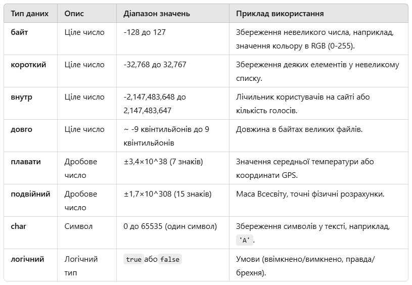

# Роботу виконала студентка ***Шроль Софія Григорівна***
> ***Київський політехнічний інституту, ІТС, группа ТЗ-22***

## Lab2
> *Варіант 25:*
- [x] Завдання 14
- [x] Завдання 5
- [x] Завдання 23
### Опис
Клас Lab2 містить програму, яка виконує математичні обчислення на основі трьох різних завдань: 14, 5 і 23.
Завдання знаходиться за *[посиланням](https://docs.google.com/document/d/1cXBG_Rrn3RhcQfThQbPZh-hUB0qAvCNf/edit)*

Кожне завдання приймає 4 вхідних параметрів типу double і виводить результат рівняння типу double у командний рядок та термінал.

> ***Контрольні питання:***
### 1. В чому полягає різниця між ключовими та зарезервованими словами?
Ключові слова — це слова, які мають особливе значення в мові програмування і не можуть використовуватися як імена змінених, класів чи інших ідентифікаторів. Наприклад, у Java ключові слова: if, else, while, return.

Зарезервовані слова — це слова, які зарезервовані мовою програмування, але можуть не мати поточного функціоналу. Вони залишені для майбутніх розширень. Наприклад, у Java зарезервовані слова gotoі const, але вони не використані.

Різниця:

Ключові слова мають активне значення.
Зарезервовані слова не використовуються, але не можуть бути використані як імена.

### 2. Які примітивні типи даних Ви знаєте? Для кожного з них наведіть приклади, коли найбільш ефективно використовувати саме цей тип (наприклад: довжина файлу, кількість зірок на небі, рахунок у футбольному матчі, маса всесвіту, заробітна платня, ...).

### 3. Що таке знакові та беззнакові типи? До якої групи відноситься кожен з примітивних типів даних?
Знакові типи підтримуються як додаткові, так і від'ємні значення (наприклад, int, long, byte, short).
Беззнакові типи підтримують лише додаткові значення (зазвичай використовувати в мовах на кшталт C/C++, наприклад unsigned int).
На Яві всі примітивні цілі типи ( byte, short, int, long) є знаковими . Віняток — char, який беззнаковий, бо зберігає значення Unicode.

### 4. Яке максимальне число можна записати у змінну типу short, char, int, long?
int, long?
short:
2
15
−
1
=
32
,
767
2
15
−1=32 ,767
char:
2
16
−
1
=
65
,
535
2
16
−1=65 ,535(оскільки беззнаковий)
int:
2
31
−
1
=
2
,
147
,
483
,
647
2
31
−1=2 ,147 ,483 ,647
long:
2
63
−
1
=
9
,
223
,
372
,
036
,
854
,
775
,
807
2
63
−1=9 ,223 ,372 ,036 ,854 ,775 ,807

### 5. Змінна типу byte може приймати значення у діапазоні -128..127. Чому цей діапазон саме такий? Чому від’ємних значень більше ніж додатних?
Діапазон обумовлений кількістю бітів : byte— це 8 біт. Один біт використовується для позначення знака (0 — додаткове число, 1 — від'ємне).
Діапазон:
−
2
7
− 2
7
до
2
7
−
1
2
7
−1, тобто -128 до 127.
Від'ємних значень більше, бо 0 визнано додатковим числом.

### 6. Що таке система числення? Як переводити значення з однієї системи числення у іншу?

Система число — спосіб представлення чисел за певними правилами. Найбільш розширені:
Двійкова (бінарна, основа 2).
Десяткова (основа 10).
Шістнадцяткова (основа 16).

Переведення :

З будь-якої системи в десяткову: множимо кожну цифру на її основі у відповідному ступені.

З десяткової в будь-яку: ділимо на основі, записуючи залишки.

### 7. Що таке «Доповняльний код»?

Доповнювальний код (Two's complement) — це спосіб представлення від'ємних чисел у двійковій системі.
Як формується:
Інвертуємо всі біти числа (перетворюємо 0 на 1 і 1 на 0).
Додаємо 1 до результату.
Переваги :
Універсальне додавання і віднімання.
Уникнення подвійного представлення нуля.

### 8. Пояснити результат роботи такого фрагмента коду:

int a = 2_000_000_000;
int b = 2_000_000_000;
int c = a + b;
System.out.println(c);

Тип intмає максимальне значення
2
,
147
,
483
,
647
2 ,147 ,483 ,647.

Сума 2_000_000_000 + 2_000_000_000 = 4_000_000_000 виконала цю частину, що втратила переповнення .

У результаті значення обчислюється за модулем
2
32
2
32
, і виходить:
4
0
0
0
0
0
0
0
00
−
2
32
=
−
29
4
9
6
7
2
96
4
0
​
0 0
0
​
0 0
0
​
00−2
32
=− 29 4
9
​
6 7
2
​

Вивід: -294967296.

### 9. Чим тип float відрізняється від double?

Точність :
floatмає точність до 7 знаків після коми.
doubleмає точність до 15-16 знаків після коми.

Розмір у пам'яті :
float: 32 бити.
double: 64 біти.

Застосування :
floatвибір, коли потрібна економія пам'яті.
double— для наукових обчислень, де важлива висока точність.

### 10. Що таке число з рухомою комою? Що таке мантиса та степінь?

Число з рухомою комою — це формат представлення чисел, що дозволяє зберегти дробові значення у вигляді:

Н =
М
×
Б
𝐸
Н=М×Б
E

де
М
М— мантиса,
Б
Б— основа (зазвичай 2),
𝐸
E— степінь.

Мантиса — дробова частина числа, яка містить його точне значення.

Степінь — переконання, скільки число більше слідти або зменшити (перепубликуйте кому).

Приклад : Число
123,45
123,45у двійковому представленні:

1,2345
×
1
0
2
1,2345×1 0
2

де мантиса —
1,2345
1,2345, степінь —
2

### 11. Що таке Double.NaN?

NaN (Not a Number) — це спеціальне значення double, яке позначає результат недопустимих математичних типів операцій, наприклад:
Ділення 0 на 0: 0.0 / 0.0.
Квадратний корінь із від'ємного числа.
Особливість : Double.NaNне дорівнює жодному значенню, навіть самому собі.

### 12. Пояснити результат роботи такого фрагменту коду:
System.out.println(Double.NaN==Double.NaN);

Результат : false.

Пояснення :

Відповідно до IEEE 754, значення NaNне рівні навіть самому собі.
Для перевірки, чиє значення NaN, потрібно використовувати метод Double.isNaN().

### 13. Пояснити різницю між преінкрементом та постінкрементом. Навести приклади, коли ці операції призводять до різних результатів.

Префіксний інкремент ( ++x):
Збільшує значення змінної на 1 до використання .
Постфіксний інкремент ( x++):
Збільшує значення змінної на 1 після використання .

int x = 5;

int y = ++x; // x = 6, y = 6 (збільшення перед присвоєнням)

int z = x++; // z = 6, x = 7 (збільшення після присвоєння)

### 14. В чому різниця між логічною та побітовою операцією AND? Чому звичайна операція AND (&) є в обох варіантах, а її короткозамкнута версія (&&) лише тільки логічна?

Логічна І ( &&) :
Працює з логічними значеннями ( true/ false).
Виконує короткозакріплений розрахунок: якщо перше значення false, друге не перевіряється.
Побітова І ( &) :
Працює з кожним бітом числа.
Не використовує короткозамкнення.
Чому немає короткозакріплення для &?

Побітова операція завжди повинна виконувати обчислення для всіх бітів.

### 15. В чому різниця між OR та XOR?

АБО ( |) :
Дає 1, хоча якщо б один біт дорівнює 1.

XOR ( ^) :
Дає 1, якщо різні бути.

### 16. Проаналізувати наступний фрагмент програми. Передбачити його результат. Запустити. Пояснити.
boolean a = true && false | false;
System.out.println(a = false);

boolean b = true && false || false;
System.out.println(b = true);

Передбачення :

Для a:

Вираз true && false || falseобчислюється як false || false→ false.

Операція a = falseприсвоює falseзміни aі повертає false.

Вивід: false.

Для b:

Вираз аналогічно дає false.

Операція b = trueзмінює значення bна trueі повертає true.

Вивід: true.

Результат роботи :

false

true

