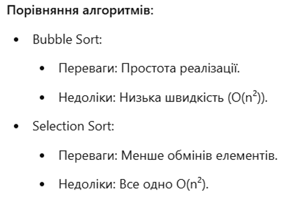
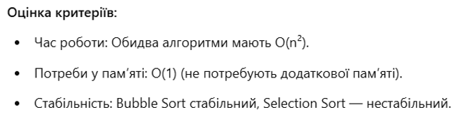
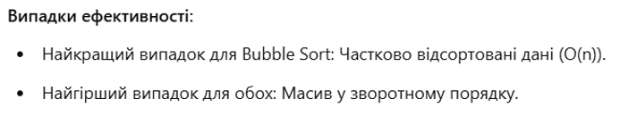
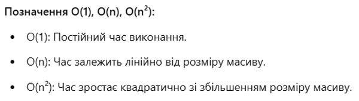

# Роботу виконав студент ***Шроль Софія Григорівна***
> ***Київський політехнічний інституту, ІТС, група ТЗ-22***

## Lab5

> *Варіант №25*
- Тип масиву: double[]
- Порядок сортування: За зростанням
- Метод 1: Bubble sort
- Метод 2: Selection sort
### Опис
Завдання розташовується в класі Task, має 2 розрахункових метода(selection sort та bubbleSort), головний(main) та додаткові(3). 2 розрахункових метода сортують отриманий масив двома різними способами та викликаються окремо.

Для обох методів створені додаткові printInsertionSortedArray та printBubbleSortedArray, з параметром у вигляді масиву з яким ми пряцюємо, які виводять користувачу масив, який він задав, і новий відсортований масив(різниця методів полягає лише в способі сортування, а результат залишається однаковим - відсортований за зростанням масив чисел типу double[]).

> ***Контрольні питання:***

### 1. Порівняйте та назвіть переваги та недоліки таких методів сортування: сортування бульбашкою, сортування вибором, сортування вставкою.

### 2. Оцініть кожен з методів відповідно до наступних критеріїв:
	- час роботи;
	- потреби у додатковій пам’яті;
	- стабільність.
### За якими ще критеріями ви можете порівняти ці алгоритми?

### 3. Який випадок є найкращім або найгіршим для роботи цих алгоритмів? (Наприклад: частково відсортований масив або масив, відсортований у зворотному порядку). Який з методів забезпечить у цих випадках найкращій/найгірший результат?

### 4. Що означають позначення O(1), O(n), O(n2)?

