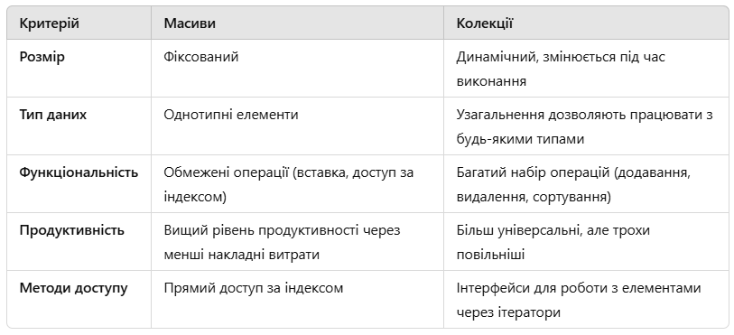
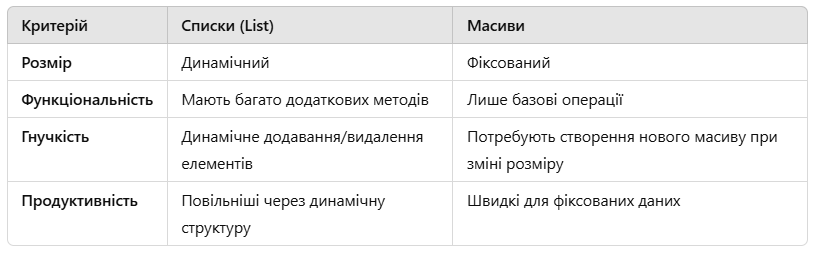
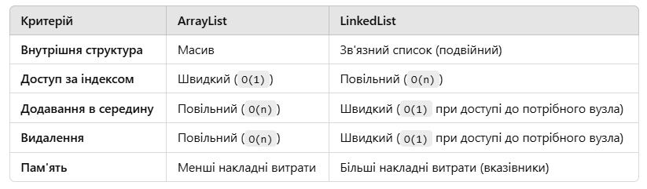

# Роботу виконав студент ***Шроль Софія Григорівна***
> ***Київський політехнічний інституту, ІТС, група ТЗ-22***
## Lab7

> *Варіант №25*
- [x] Завдання 5
### Опис
Дані варіанта №25: Сервіс пошуку товарів (список інтернет-магазинів)
Інтернет-магазин (назва магазина, список товарів та цін на них в цьому магазині)
Товар (назва товару, рекомендована ціна виробника)

Задача:
1) Знайти мінімальну ціну на заданий товар.
2) Скласти список магазинів, в яких заданий товар можна купити по мінімальній ціні
3) Визначити, чи є магазин, усі товари якого можна купити по цінам, дешевшим ніж рекомендована ціна виробника

Результат:
Тестування коду: Ви отримаєте коректний результат для введених даних. Код підтримує динамічне додавання магазинів і товарів.

> ***Контрольні питання:***

### 1. Для чого призначений Collections Framework?

Collections Framework в Java є набором класів та інтерфейсів для роботи з колекціями об'єктів. Його призначення:

- Упорядкування даних: Забезпечення зручної структури для зберігання даних (списки, множини, карти).
- Ефективна обробка: Оптимізовані алгоритми для додавання, видалення, пошуку та сортування елементів.
- Універсальність: Уніфікований API для роботи з новими типами колекції через інтерфейси ( List, Set, Map).
- Підтримка модифікацій: Просте управління операціями на колекціях (наприклад, сортування, перетворення).
- Типобезпека: Використання узагальнення (Generics) для уникнення помилок типу.

### 2. В чому полягає різниця між масивами та колекціями?

### 3. Які особливі властивості є у списків порівняно з іншими типами колекцій?

Списки ( List) мають такі особливості:

- Збереження порядку: Елементи додаються у визначеному порядку, і цей порядок зберігається.
- Доступ за індексом: Ви можете отримати доступ до елементів за їх індексом.
- Дублікати: Списки допускають наявність дублікатів.
- Багатий набір методів: Методи для пошуку ( indexOf, lastIndexOf), маніпуляцій ( add, remove, set) та ітерацій ( listIterator).

### 4. Чим списки відрізняються від масивів?

### 5. Чим ArrayList відрізняється від LinkedList? Який з них у яких випадках краще використовувати?

Коли використовувати:

- ArrayList: якщо потрібен швидкий доступ до елементів за індексом або часто додаються елементи в кінець списку.
- LinkedList: Для часткових операцій додавання/видалення елементів на початку чи в списку середини.

### 6. Що таке Iterator? В чому полягають переваги використання ітератора у порівнянні з класичним циклом ”for(int i=0; i<collection.size(); i++) { /* ... */  }”?

Ітератор — це інтерфейс, який дозволяє перебирати елементи колекції результатів.

Переваги:

- Абстракція: Позбавляє необхідність знати реалізацію колекції.
- Універсальність: Підходить для всіх типів колекцій, навіть якщо доступ до індексу не підтримується.
- Модифікація: Дозволяє безпечно видаляти елементи під час ітерації ( remove()).
- Захищеність: Захищає від помилок при зміні структури колекції під час перебору (через ConcurrentModificationException).

### 7. Що таке типізовані та нетипізовані колекції?

- Типізовані колекції (Generics):

Декларують тип даних, які вони містять, наприклад, List<String>.

Переваги: ​​Безпечність типів, уникнення помилок приводу.

- Нетипізовані колекції:

Не обмежують типи даних, наприклад, List.

Недоліки: Потребують ручного приводу типів, що можуть спричинити помилки ( ClassCastException).

### 8. Для чого потрібен інтерфейс RandomAccess?

- RandomAccess — маркерний інтерфейс, який позначає, що реалізація колекції підтримує швидкий доступ до індексу.

Приклад: ArrayList реалізує RandomAccess, що гарантує O(1)для операцій getі set.

Важливість: Дозволяє алгоритмам (наприклад, в Collections.sort) вибирати оптимальні стратегії роботи з колекціями.

### 9. Чим Collection відрізняється від Collections?

- Колекція:

Інтерфейс, який представляє групу об'єктів.

Підінтерфейси: List, Set, Queue.

- Колекції:

Утилітний клас, який містить статичні методи для роботи з колекціями ( sort(), reverse(), shuffle()).
